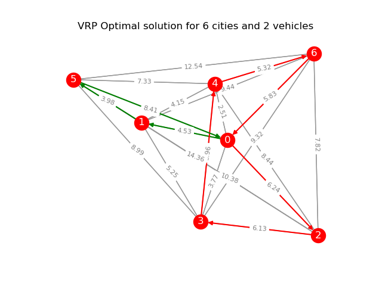

# NLP Course

### Directory:

1. `0-exam` - NLP Course exam code
2. `algorithm` - The python implementation of some famous algorithms.
    * [lru](algorithm/lru.py) - Least recently used algorithm
    * [ngram](algorithm/ngram.py) - n-gram language model
    * [search](algorithm/search.py) - BFS/DFS search algorithm implementation
3. `data` - Dataset
    * [80k news corpus](data/corpus/80k.tar.gz) - 80k news corpus
    * [Cities coordinate dataset](data/geo/cities.json) - China cities coordinate dataset
    * [titanic dataset](data/titanic/)
    * [zhwiki](data/zhwiki) - Zh wiki sample dataset
4. `notebooks` - Pratise jupyter notebooks
    * [Linear regression](notebooks/linear-regression.ipynb) - LR practise notebook
    * [Dynamic programming](notebooks/dynamic_programming.ipynb) - Dynamic programming notebook
    * [Metro exchange](notebooks/metro.ipynb) - Metro exchange notebook
    * [A* algorithm](notebooks/a_star.ipynb) - A star algorithm notebook
5. `lisp` - Some algorithm and practice codes written with Common LISP
    * [paip-ex1.lisp](lisp/paip-ex1.lisp) - PAIP book chapter 1 exams
    * [tower.lisp](lisp/tower.lisp) - The tower of Hanoi problem from `Concrete mathematic` book
6. `project` - class related project
    * metro_exchange
        * [amap_metro_api.py](project/metro_exchange/amap_metro_api.py) - AMap Metro API to download metro data
        * [metro_crawler.py](project/metro_exchange/metro_crawler.py) - Beijing/Shanghai/Guangzhou/Shenzhen metro data crawler
        * [metro_exchange.py](project/metro_exchange/metro_exchange.py) - Metro exchange A* algorithm
    * wiki_word2vec
        * [train.py](project/wiki_word2vec/train.py) - Zh-wiki Word2Vec model trainning program

### Week-1 Graph search

1. [Breadth first search](algorithm/search.py)
2. [Depth first search](algorithm/search.py)
3. [Gramma tree](0-exam/sentence_parser.py)

### Week-2 Language model

1. [n-gram model](algorithm/ngram.py)
2. [Linear regression](algorithm/linear_regression.py)
3. [Linear regression result compare](notebooks/linear-regression.ipynb)
4. [Bag of words](algorithm/bag_of_words.py)
5. [Good turning estimate](algorithm/good_turning_estimate.py)

### Week-3 Best first search

1. [A star algorithm](algorithm/a_star.py)
2. [Metro exchange](project/metro_exchange)

### Week-4 Dynamic programming

1. [Rod cutting](algorithm/rod_cutting.py)
2. [edit distance](algorithm/edit_distance.py)
3. [VRP](algorithm/vrp.py)    
Example solution for dataset [cities](data/vrp/cities.txt)

### Week-5 Word2Vec

1. [Wiki word2vec train](project/wiki_word2vec/train.py)

### Week-6 News option extraction
1. [News option extraction model prototype](notebooks/news_options.ipynb) NOT Complete yet!!
