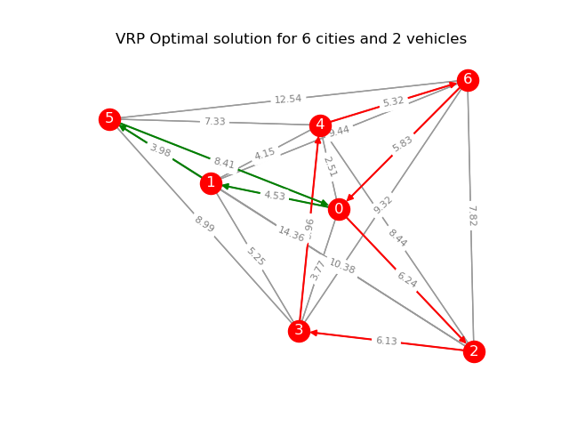

# VRP Problem

## Usage

```
# Run with `cities.txt` dataset and 2 vehicles
python vrp.py --path ../data/vrp/cities.txt --vehicles 2
```

## Example solution

Example dataset: [cities](../../data/vrp/cities.txt)



----

## TODO

1. The search space is huge, need further optimze
